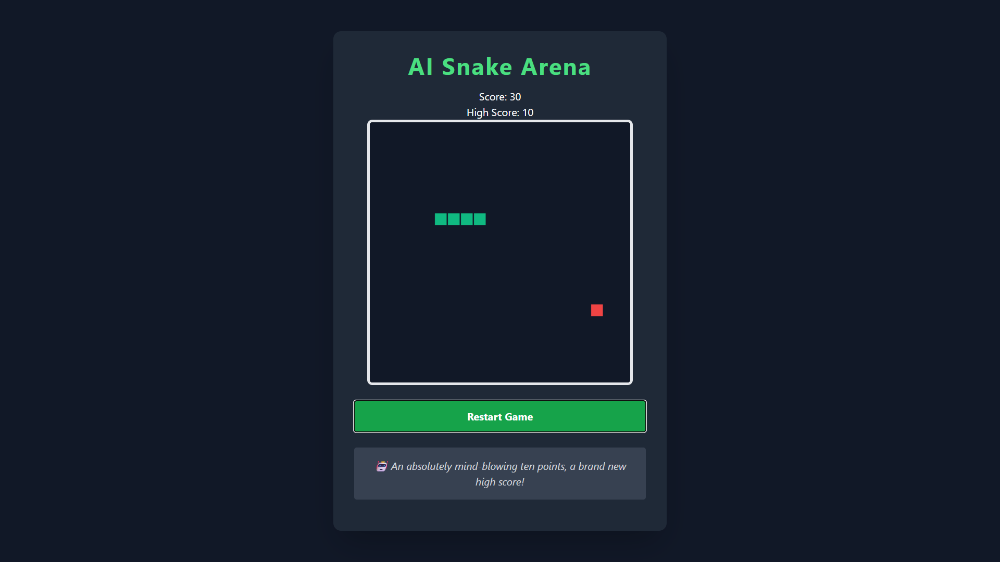

# AI Snake Arena

## Overview
AI Snake Arena is a browser-based implementation of the classic Snake game developed using HTML, Tailwind CSS, and JavaScript. The game was created by porting the core logic from my original C++ Snake Game and extending it with AI-generated live commentary using the Google Gemini API.

## Features
* Classic Snake gameplay
* AI-generated live commentary using Google Gemini
* Local fallback commentary when the AI service is unavailable
* Persistent high score using Local Storage
* Pause and resume functionality
* Support for both WASD and Arrow Key controls

## Technologies Used
* HTML5
* Tailwind CSS
* JavaScript (ES6)
* Google Gemini API

## Controls
| Key   | Action         |
| ----- | -------------- |
| W / ↑ | Move Up        |
| A / ← | Move Left      |
| S / ↓ | Move Down      |
| D / → | Move Right     |
| Space | Pause / Resume |

## Running the Project
1. Clone the repository.
2. Open `index.html` in a web browser.
3. Replace `YOUR_API_KEY` in `script.js` with your own Gemini API key.
4. Start the game.

## AI Usage
AI was used during development to:
* Convert the original C++ game logic into JavaScript.
* Generate and refine prompts for Gemini AI commentary.
* Assist with debugging JavaScript issues.
* Improve the user interface and overall gameplay experience.

## Debugging Log

### Issue 1: Reverse Snake Movement

**Problem**

The snake could immediately reverse its direction, causing instant self-collisions and resulting in unintended game-over scenarios.

**Solution**

Modified the keyboard input handling logic in `script.js` to validate movement before updating the snake's direction. Opposite-direction inputs are now ignored, preventing 180-degree turns and ensuring smoother gameplay.

---

### Issue 2: Gemini API Request Failures

**Problem**

The AI commentary feature initially failed to generate responses due to API configuration and request handling issues during integration with the Gemini API.

**Solution**

Verified the API endpoint, request format, and authentication. Added `try...catch` error handling and implemented predefined local commentary as a fallback whenever an API request fails.

---

### Issue 3: Multiple AI Requests Triggering Simultaneously

**Problem**

Multiple game events could trigger overlapping AI commentary requests before previous requests completed, leading to inconsistent commentary updates.

**Solution**

Implemented request management to ensure only one AI request is processed at a time. A timer was also added to automatically replace AI-generated commentary with predefined local commentary after a short duration, maintaining a consistent user experience.
